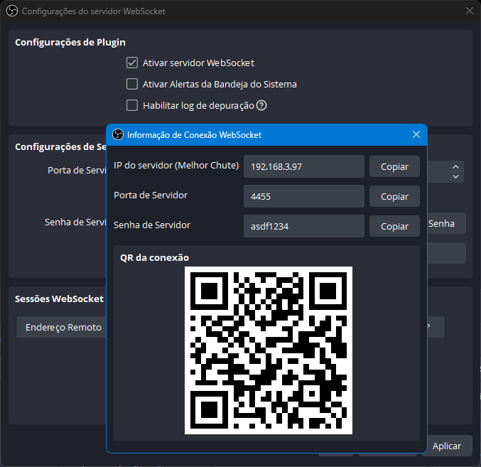
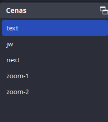

# SC - OBS Control LS

<div align="center">
   <!--  -->
   <!--  -->
   
   <!--  -->
   
   
   
   
</div>

---

> Electron + Typescript + Next

---

## Download

```sh
git clone https://github.com/saulotarsobc/sc-obs-control-ls;
cd sc-obs-control-ls;
npm install;
npm run dev;
```

## OBS Version ⚠️ [👉 v29.1.3](https://www.obsstudio.net/latest-obs-studio/)

### Login

- PORT: `4455`
- PASSWORD: `asdf1234`

<div align="center">
  
</div>

### Scenes

- ``text``:
  - `description`: *Text year*
  - `type`: *image*
- ``jw``
  - `description`: *JW Sign Library second window*
  - `type`: *Window capture*
- ``next``
  - `description`: *Intelbras SIM Next window*
  - `type`: *Window capture*
- ``zoom-1``
  - `description`: *Zoom meetings window*
  - `type`: *Window capture*
- ``zoom-2``
  - `description`: *Zoom meetings window*
  - `type`: *Window capture*

---

<div align="center">
  
</div>